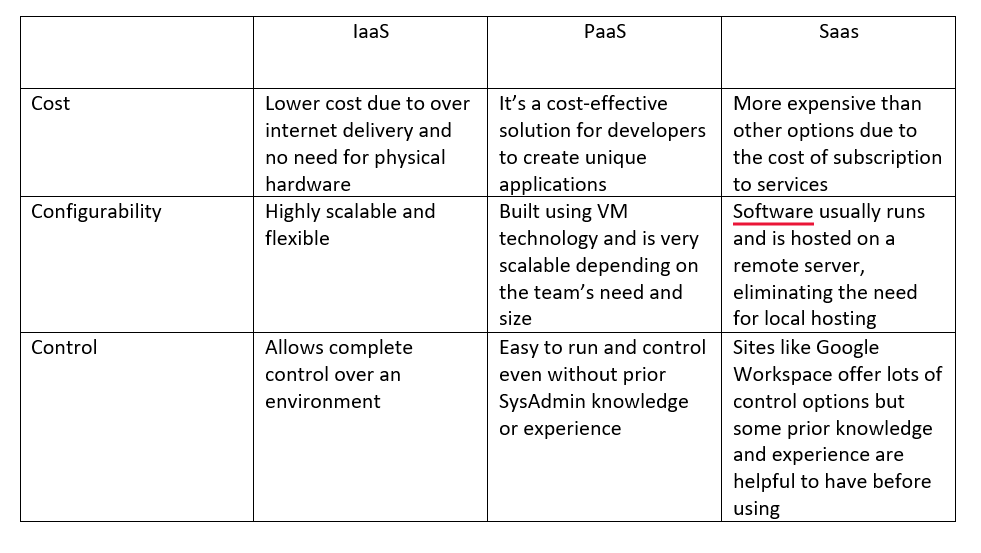

# Exercises - Chapter 03 Selecting a Service Platform

# 1. Compare IaaS, PaaS, and SaaS on the basis of cost, configurability, and control (hint make a chart)
	

# 2. What are the caveats to consider in adopting Software as a Service?

You typically have less control with available features and customizability vs IaaS and PaaS. SaaS also tends to waste resources by having unnecessary apps running in the background that you may not need to run your business efficiently. 

# 3. List the key advantages of virtual machines.

- Separate physical hardware isn’t necessary to run the VM. Shares hardware resources with the machine it’s being hosted on.
- Can be set up quickly using a shell script and VMware or VirtualBox. 
- Can run multiples VMs at once all using separate operating systems on the same computer

# 4. Why might you choose physical over virtual machines?

- Less latency
- VMs require you to share resources with the computer it’s being hosted on. A physical machine can have its own hardware making it more powerful and faster potentially. 

# 5. Which factors might make you choose private over public cloud services?
- Public cloud services are hacked and breaches more frequently than private services.
- Overall, private services are more secure and offer higher levels of encryption vs public services.
